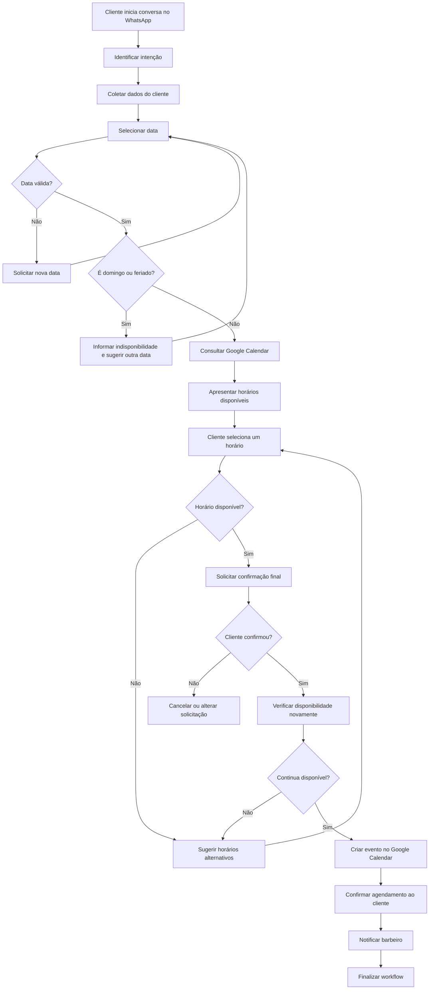

# Automação de Agendamentos para Barbearia com n8n

Este repositório apresenta os requisitos e o prompt para criação de uma automação de agendamentos de uma barbearia pelo WhatsApp, utilizando o n8n e o Google Calendar.

## Objetivo

Criar um workflow no n8n que permita aos clientes da barbearia:

- Iniciar o atendimento pelo WhatsApp;
- Informar o serviço desejado;
- Consultar datas e horários disponíveis;
- Selecionar um horário;
- Confirmar o agendamento;
- Receber uma mensagem de confirmação;
- Notificar o barbeiro responsável.

## Público-alvo

Clientes da barbearia que desejam consultar horários e realizar agendamentos pelo WhatsApp.

## Ferramentas envolvidas

- n8n;
- WhatsApp;
- Google Calendar;
- API de feriados, quando necessária;
- Banco de dados ou Data Store do n8n, caso seja necessário armazenar o estado da conversa.

## Fluxo esperado

1. O cliente inicia uma conversa pelo WhatsApp.
2. O workflow identifica a intenção de agendamento.
3. O cliente informa o nome e o serviço desejado.
4. O cliente seleciona uma data.
5. O workflow valida a data informada.
6. O sistema verifica se a data corresponde a um domingo ou feriado.
7. O workflow consulta o Google Calendar.
8. Os horários disponíveis são apresentados ao cliente.
9. O cliente escolhe um horário.
10. O sistema verifica novamente a disponibilidade.
11. O cliente confirma os dados do agendamento.
12. O evento é criado no Google Calendar.
13. O cliente recebe a confirmação pelo WhatsApp.
14. O barbeiro responsável recebe uma notificação.
15. O workflow é finalizado.

## Fluxograma



## Dados solicitados ao cliente

- Nome completo;
- Número de telefone;
- Serviço desejado;
- Barbeiro de preferência, quando aplicável;
- Data desejada;
- Horário desejado;
- Observações, quando necessárias.

## Dados registrados no Google Calendar

- Nome do cliente;
- Telefone;
- Serviço contratado;
- Barbeiro responsável;
- Data e horário do atendimento;
- Duração estimada;
- Status do agendamento;
- Observações adicionais.

## Regras de negócio

- Não permitir agendamentos aos domingos;
- Não permitir agendamentos em feriados;
- Utilizar o fuso horário `America/Sao_Paulo`;
- Não aceitar datas ou horários anteriores ao momento atual;
- Respeitar o horário de funcionamento da barbearia;
- Não permitir conflito de agenda para o mesmo barbeiro;
- Verificar novamente a disponibilidade antes de criar o evento;
- Apresentar opções alternativas quando o horário estiver ocupado;
- Concluir o agendamento somente após a confirmação do cliente;
- Encerrar ou pausar o atendimento após um período sem resposta;
- Registrar erros para acompanhamento e correção;
- Garantir que cada serviço utilize sua duração correspondente.

## Parâmetros editáveis

Os itens abaixo devem ser configurados conforme as regras da barbearia:

```yaml
timezone: America/Sao_Paulo
horario_abertura: "09:00"
horario_fechamento: "19:00"
dias_funcionamento:
  - segunda
  - terca
  - quarta
  - quinta
  - sexta
  - sabado
antecedencia_minima_minutos: 60
limite_agendamento_dias: 30
tempo_expiracao_conversa_minutos: 15
```

## Nós sugeridos no n8n

- **Webhook ou WhatsApp Trigger:** recebe as mensagens enviadas pelo cliente;
- **Set ou Edit Fields:** organiza e padroniza os dados recebidos;
- **Switch:** identifica a etapa atual da conversa;
- **IF:** valida datas, horários, domingos, feriados e disponibilidade;
- **Code:** executa validações e manipulações de data quando necessário;
- **Date & Time:** ajusta datas, horários e fuso horário;
- **HTTP Request:** integra o workflow à API do WhatsApp ou ao serviço de feriados;
- **Google Calendar:** consulta disponibilidade e cria o evento;
- **Data Store ou banco de dados:** mantém o contexto da conversa de cada cliente;
- **Wait:** aguarda a resposta do cliente em etapas específicas;
- **Execute Workflow:** separa partes da automação em subworkflows reutilizáveis;
- **Error Trigger:** registra e comunica falhas na execução.

## Mensagens de exemplo

### Início do atendimento

```text
Olá! Bem-vindo à barbearia. 💈

Para começar, informe o seu nome e selecione o serviço desejado.
```

### Data inválida

```text
A data informada não está disponível para agendamento.

Não realizamos atendimentos aos domingos ou feriados. Escolha outra data para continuar.
```

### Horário indisponível

```text
Esse horário não está mais disponível.

Confira as próximas opções:
1. 14:00
2. 15:30
3. 17:00
```

### Confirmação final

```text
Confira os dados do seu agendamento:

Cliente: {{nome_cliente}}
Serviço: {{servico}}
Barbeiro: {{barbeiro}}
Data: {{data}}
Horário: {{horario}}

Responda CONFIRMAR para concluir ou ALTERAR para escolher outro horário.
```

### Agendamento concluído

```text
Agendamento confirmado com sucesso! ✅

Data: {{data}}
Horário: {{horario}}
Serviço: {{servico}}
Barbeiro: {{barbeiro}}

Aguardamos você!
```

### Notificação ao barbeiro

```text
Novo agendamento confirmado.

Cliente: {{nome_cliente}}
Telefone: {{telefone}}
Serviço: {{servico}}
Data: {{data}}
Horário: {{horario}}
Observações: {{observacoes}}
```

## Estrutura de dados sugerida

```json
{
  "cliente": {
    "nome": "Nome do cliente",
    "telefone": "5511999999999"
  },
  "agendamento": {
    "servico": "Corte de cabelo",
    "barbeiro": "Nome do barbeiro",
    "data": "2026-10-05",
    "horario": "14:30",
    "duracao_minutos": 45,
    "timezone": "America/Sao_Paulo",
    "status": "aguardando_confirmacao",
    "observacoes": ""
  },
  "conversa": {
    "etapa": "confirmacao",
    "ultima_interacao": "2026-10-01T10:00:00-03:00"
  }
}
```

## Prompt para desenvolvimento da automação

```text
Atue como um especialista em automações utilizando n8n.

Desenvolva a estrutura de um workflow para automatizar o agendamento de horários de uma barbearia pelo WhatsApp, com integração ao Google Calendar.

Explique detalhadamente:

1. Quais nós do n8n devem ser utilizados;
2. A função de cada nó;
3. Como os nós devem ser conectados;
4. A lógica completa do workflow;
5. As credenciais e integrações necessárias;
6. Como manter o estado da conversa de cada cliente;
7. Como tratar erros, respostas inválidas e horários indisponíveis;
8. Como evitar agendamentos duplicados.

O cliente deverá iniciar uma conversa pelo WhatsApp, informar seus dados, escolher um serviço, consultar datas e horários disponíveis e confirmar o agendamento.

Ferramentas envolvidas:
- n8n;
- WhatsApp;
- Google Calendar;
- API de consulta de feriados, quando necessária.

Fluxo esperado:
1. O cliente inicia a conversa no WhatsApp;
2. O workflow identifica a intenção de agendamento;
3. O cliente informa nome, serviço e barbeiro de preferência;
4. O cliente seleciona uma data;
5. O workflow valida a data;
6. O sistema verifica se a data é domingo ou feriado;
7. O Google Calendar é consultado;
8. Os horários disponíveis são apresentados;
9. O cliente seleciona um horário;
10. O workflow verifica novamente a disponibilidade;
11. O cliente confirma os dados;
12. O evento é criado no Google Calendar;
13. O cliente recebe a confirmação pelo WhatsApp;
14. O barbeiro responsável recebe uma notificação;
15. O workflow é finalizado.

Regras:
- Não agendar aos domingos ou feriados;
- Utilizar o fuso horário America/Sao_Paulo;
- Não aceitar datas ou horários anteriores;
- Respeitar o horário de funcionamento;
- Não criar dois agendamentos para o mesmo barbeiro no mesmo período;
- Considerar a duração de cada serviço;
- Sugerir horários alternativos quando necessário;
- Concluir o agendamento somente após a confirmação final do cliente;
- Registrar erros e falhas para acompanhamento;
- Pausar ou encerrar conversas sem resposta após o tempo configurado.

Apresente a resposta com:
1. Visão geral da solução;
2. Lista dos nós necessários;
3. Função de cada nó;
4. Ordem de conexão;
5. Explicação passo a passo;
6. Consulta de disponibilidade;
7. Validação de domingos e feriados;
8. Controle de conflitos;
9. Tratamento de erros;
10. Exemplos de mensagens;
11. Estrutura dos dados;
12. Fluxograma textual;
13. Melhorias futuras.

Caso informações como horário de funcionamento, duração dos serviços, quantidade de barbeiros ou antecedência mínima não tenham sido fornecidas, apresente valores recomendados e identifique-os como parâmetros editáveis.
```

## Melhorias futuras

- Reagendamento pelo WhatsApp;
- Cancelamento automático;
- Lembretes antes do atendimento;
- Confirmação de presença;
- Lista de espera para horários ocupados;
- Cadastro de diferentes durações por serviço;
- Agenda independente para cada barbeiro;
- Relatórios de agendamentos e cancelamentos;
- Pesquisa de satisfação após o atendimento;
- Integração com sistema de pagamentos;
- Painel de acompanhamento dos atendimentos.

## Observação

Antes de colocar o workflow em produção, configure corretamente as credenciais, os calendários de cada barbeiro, os horários de funcionamento, a duração dos serviços e as regras de proteção de dados dos clientes.
